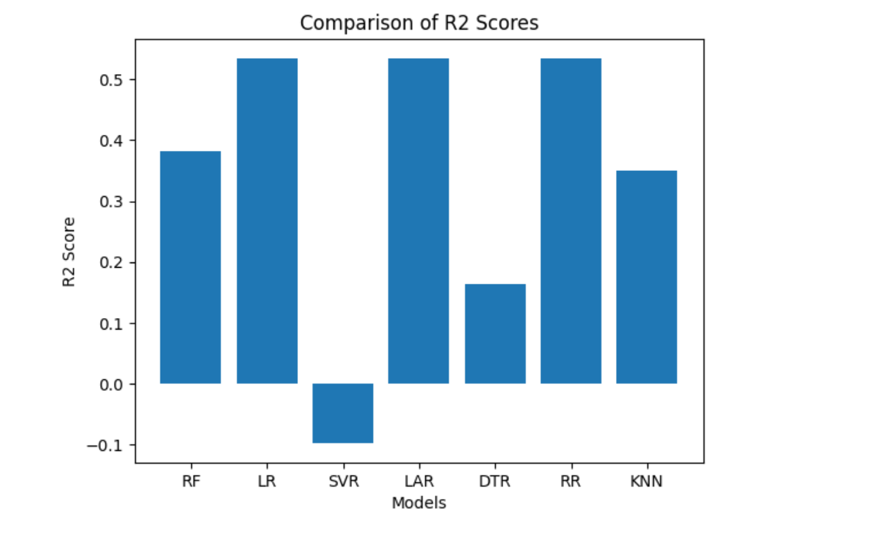

# Predicting-Housing-Prices

## Building regression model to predict housing prices based on various features like area, number of bedrooms, bathroom, etc.

# Author

Name: Jacinta Chioma Odirichukwu (PhD in Computer Science)
Phone: +2348153496082
Email: lmssmarthub@gmail.com

## Purpose
The House Price Prediction project aims to develop a regression model to predict housing prices based on various features such as area, number of bedrooms, bathrooms, and other relevant factors. This project is designed to assist buyers, sellers, and real estate professionals in making informed decisions during real estate transactions.

## Objectives
1. **Predictive Modeling:** Develop a robust regression model that accurately predicts housing prices.
2. **User-Friendly Interface:** Provide a user-friendly interface for users to input property details and obtain price predictions.

## Key Features
- **Predictive Models:** Utilize various regression algorithms to determine the most effective model for predicting housing prices.
- **User Input:** Allow users to input property details through a user interface for instant predictions.
- **Data Visualization:** Include visualizations of key features and their impact on housing prices.
- **Model Evaluation:** Implement metrics to evaluate and compare the performance of different regression models.

## Setup, rerequisites, and Run Instructions

- Python 3.x
- Required Python packages, the Setup, rerequisites, and Run Instructions(specified in `docs/requirements.txt`)

## Project Structure
The repository is organized as follows:

src/: Contains the source code for the project, the entire code in .ipynb ext.
dataset/: Directory the datasets.
docs/requirements.txt: Include documentation files, if any

1.  **Data Collection:** Download Dataset

To use this project, you need to download the dataset from the following URL:

[**Download Dataset**](https://www.kaggle.com/datasets/ashydv/housing-dataset)

Please ensure that you have the necessary permissions to access and use the dataset according to its licensing terms. Once downloaded, you can place the dataset file in the appropriate directory within your project.

2.  **Data Exploration:** Explored the dataset to understand its structure, features, and distributions.
Identified potential relationships between features and the target variable (price).
3. **Data Preprocessing:** Handled missing values, eliminated duplicates, and encoded categorical variables.
Ensured data cleanliness and prepared it for modeling.
4. **Feature Engineering:** Created new features and selected relevant ones to enhance model performance.
Utilized techniques like SelectKBest to choose top features.
5. **Undersampling and Oversampling:** Balanced the imbalanced target variable using RandomUnderSampler and RandomOverSampler.
Investigated the impact of class distribution on model performance.
6. **Regression Modeling:** Explored different regression algorithms such as Random Forest, Linear Regression, Least Angle Regressor, DecisionTreeRegressor, Ridge Regression, Support Vector Regression (SVR), K-Nearest Neighbors (KNN).
Evaluated model performance using metrics like Mean Squared Error, Root Mean Squared Error, and R-squared.
7. Model Evaluation and Comparison:
Compared and analyzed the performance of different regression models.
Explored the impact of feature importance on predictive accuracy.
8. Vizualized the performance using pyplot from matplotlib (matplotlib.pyplot)
## Result

A comparison of the R2 values of several models is shown in a bar chart.
### R² (Coefficient of Determination)

R² measures the proportion of the variance in the dependent variable that is predictable from the independent variables. It ranges from 0 to 1, where 0 indicates that the model does not explain any variability, and 1 indicates a perfect fit.

### Interpretation of the Bar Chart

Each bar represents the R² score of a specific model. Higher R² scores indicate a better fit of the model to the data.

### Models

- 'RF' (Random Forest) has an R² score of 0.3818.
- 'LR' (Linear Regression) has an R² score of 0.5347.
- 'SVR' (Support Vector Regressor) has an R² score of -0.0979.
- 'LAR' (Lasso Regression) has an R² score of 0.5347.
- 'DTR' (Decision Tree Regressor) has an R² score of 0.1631.
- 'RR' (Ridge Regressor) has an R² score of 0.5345.
- 'KNN' (K-Nearest Neighbors) has an R² score of 0.3491.

### Interpretation

- Linear Regression ('LR') and Lasso Regression ('LAR') have the highest R² scores, indicating a relatively better fit to the data.
- Support Vector Regressor ('SVR') has a negative R² score, which suggests that the model performs poorly and may not be suitable for the given data.
- Random Forest ('RF') and Decision Tree Regressor ('DTR') have moderate R² scores.
- The R² scores provide an overview of how well each model explains the variability in the target variable.

### Considerations

While R² is a useful metric, it's essential to consider other factors such as model interpretability, computational efficiency, and potential overfitting. It might be worthwhile to further investigate the models with higher R² scores ('LR', 'LAR') and explore whether additional model tuning can improve performance.

8. Model Deployment:
Deployed the selected model for live predictions using Django framework.
Integrated the model into a web application accessible through endpoints. Interested in the source code of the app, contact the author.

## Conclusion
Proficiency in data preparation, feature engineering, model selection, and implementation is demonstrated by the House Price Prediction project. It serves as a thorough illustration of end-to-end machine learning development and has the potential to be improved upon and used in practical situations.

